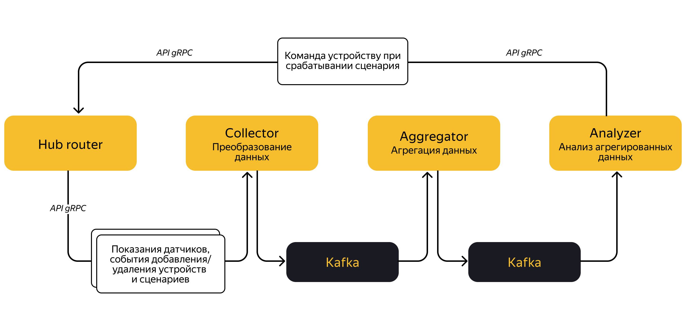

Платформа для сбора и анализа данных от датчиков умного дома. На вход подаются данные датчиков, а основная задача 
приложения — собрать эту информацию, обработать и определить, какие сценарии умного дома необходимо запустить.

Например, если поступил сигнал, что в комнате без света сработал датчик движения, то нужно включить конкретную лампочку.

* обрабатывает данные со всех проданных датчиков;
* трансформирует их в нужный формат;
* хранит описание сценариев: какую команду запустить и при каких показателях от конкретных датчиков;
* определяет необходимость запуска этих сценариев.

  Приложение будет состоять из нескольких микросервисов:
* Hub router. Хаб — это устройство, которое пользователь устанавливает у себя дома. К нему присоединяются остальные датчики, приобретённые пользователем.

Датчик температуры, освещённости или умный выключатель — любой датчик, расположенный в пределах квартиры или дома, подключается к хабу по технологии Zigbee. 
Все они передают свои показания хабу, а хаб подключается к сети Интернет по Wi-Fi и отправляет данные в систему.
Данные от хабов пользователей принимает сервис Hub router. Он преобразует эти данные в понятные системе сообщения и направляет в другой сервис — Collector. 
В рамках проекта сервис Hub router не реализован.

* [Collector.](#сервис-collector) Принимает данные каждого пользовательского хаба, которые передаёт Hub router. Преобразовывает их в формат Apache Avro и сохраняет в топик Apache Kafka. Далее из этого топика данные могут считывать другие сервисы для своих нужд.
* Aggregator. Считывает показания всех датчиков из топика Kafka и агрегирует по признаку принадлежности к хабу. Так получается снимок состояния всех датчиков, расположенных в пределах квартиры или дома. Результат агрегации записывается в топик Kafka.
* Analyzer. Считывает агрегированное состояние датчиков в квартире или доме и проверяет, соответствует ли оно условиям какого-либо сценария для этого дома.
Если состояние датчиков соответствует сценарию, то он запускается на выполнение, и Analyzer отправляет команды в Hub router. 
Hub router, в свою очередь, отправляет в нужный хаб указания выполнить конкретные действия.

Верхнеуровнево схема приложения выглядит так:

Maven cтруктура проекта содержит три верхнеуровневых модуля:
* _telemetry_. Сервисы, связанные с обработкой телеметрических данных, то есть показаний датчиков. 
Состоит из нескольких подмодулей:
    * _[collector](#сервис-collector)_ - в нём содержится код сервиса, сохраняющего в топики Kafka данные от датчиков и хабов.
    * serialization — родительский Maven-модуль, объединяющий модули со схемами Avro и Protobuf:
      * avro-schemas — схемы Avro и сгенерированные на их основе классы;
      * proto-schemas — схемы Protobuf и сгенерированные на их основе классы.
* _infra_. Maven-модуль, в котором будут инфраструктурные компоненты.
* _commerce_. Maven-модуль, включающий сервисы для поддержки продаж устройств умного дома.

## Сервис Collector

Принимает данные от хабов пользователей. Каждый хаб может отправлять две категории событий:

События от датчиков, подключённых к хабу. К ним относятся показания:
* датчика освещённости,
* датчика температуры,
* умного переключателя (это может быть выключатель света или лампочка с двумя состояниями: «вкл» и «выкл»),
* климатического датчика,
* датчика движения.

События, связанные с хабом или сценариями умного дома. К ним относятся:
* регистрация и дерегистрация в хабе нового датчика,
* добавление и удаление сценария умного дома.

Данные приходят в формате JSON, кодируются в формат Apache avro и сохраняются в топики кафка:
* _telemetry.sensors.v1_ — данные, связанные с показаниями датчиков событиями устройств.
* _telemetry.hubs.v1_ — данные, 

[Open API спецификация](telemetry/collector/http-api-spec.json)